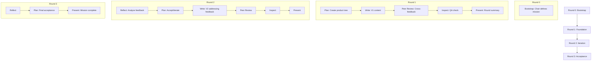

# Concrete Example Flow: TODO List MVP

**Mission:** Build a simple TODO list web application MVP  
**Team:** Richard (chair), Alex (full-stack), Jordan (tech-specialist), Marco (watchdog), Stacy (envoy)  
**V4.7 Prompts Applied:** Bootstrap, Plan & Assign, Write, Reflect, Inspect, Presentation

---

## Flow Overview



---

## Round 0: Bootstrap (Genesis)

### Step: Bootstrap
**Actor:** Richard (chair-1)  
**Principle Coverage:** 1.1 Motivation, 2.2 Personas, 14.2 Ambitious posture

**Chair Output:**
```
Mission Charter:
  THE MISSION: Build TODO List MVP with add/view/complete/delete
  CORE OBJECTIVE: Functional prototype in tight timeline
  DEFINITION OF DONE: 80% features working, user-friendly
  WHY IT MATTERS: Universal productivity need

Customized Personas:
  Alex: "Full-stack engine. Obsessed with clean code."
  Jordan: "Performance guardian. Detail is everything."
  Marco: "Last line of defense. Paranoid about edge cases."
  
Operative Domains:
  Alex: Full-Stack Development (Frontend, Backend, DB)
  Jordan: Technical Architecture (Schema, Performance)
```

**Principle Demonstration:**
- ✅ **1.1 Motivation:** Mission charter with clear "WHY IT MATTERS"
- ✅ **2.2 Personas:** Intensity-driven personas for each member
- ✅ **14.2 Ambitious:** Expands "simple TODO" into measurable MVP

---

## Round 1: Foundation

### Step 1: Plan & Assign
**Actor:** Richard (chair-1)  
**Principle Coverage:** 1.2 Breakdown, 4.1 Decide→Build, 3.1-3.6 Product Model

**Chair Creates Product Tree:**
```
TODO List MVP [Orchestration] ← Root
├── Context & Open Questions [Content]
├── Decision: MVP Features Selection [Decision] → Alex ★ ROUND 1 FOCUS
├── Product Development [Collection]
│   ├── Technical Architecture Spec [Content] → Alex ★ ROUND 1 (stack is independent)
│   ├── Database Schema Design [Content] → Alex (BLOCKED until Decision)
│   └── API Design Document [Content] → Alex (BLOCKED until Decision)
├── Marketing & Launch [Collection]
│   └── Launch Announcement [Content] → Jordan (BLOCKED until Decision)
└── Market Research [Collection]
```

> ⚠️ **DECIDE → BUILD ENFORCEMENT:**  
> API Design, Database Schema, and Launch Announcement are created in the tree but **NOT assigned in Round 1**. They wait for the MVP Features decision.

**Round 1 Directives (Only 2 products):**
| Product | Assignee | Importance | Directive |
|---------|----------|------------|-----------|
| MVP Features Selection | Alex | 10 | Define core features with prioritization rationale. This gates all downstream work. |
| Technical Architecture | Alex | 8 | Document stack (React/Node/MongoDB). Stack choice is independent of features. |

**Principle Demonstration:**
- ✅ **1.2 Breakdown:** Complex mission → hierarchical product tree
- ✅ **4.1 Decide→Build:** Decision product BEFORE content specs. API/Schema BLOCKED.
- ✅ **3.5 Composition:** Collection → Content only

---

### Step 2: Write
**Actors:** Alex (operative-1)  
**Principle Coverage:** 1.4 Success Metrics, 14.1 Context-driven

**Alex Writes (2 products only — respecting Decide→Build):**

| Product | Version | Key Content | DoD Coverage |
|---------|---------|-------------|--------------|
| MVP Features Selection | V1 | Core 4: add/view/complete/delete. Edit deferred to V2. Prioritization matrix included. | ✅ Complete |
| Technical Architecture | V1 | React + Node + MongoDB. <2s load target. | ⚠️ Needs performance metrics |

> 📋 **Jordan has no assignments in Round 1** — Launch Announcement waits for features decision.

**Principle Demonstration:**
- ✅ **4.1 Decide→Build:** Only Decision + independent Tech Arch in R1
- ✅ **1.4 Metrics:** DoD includes success criteria
- ✅ **14.1 Context:** Content addresses chair's directive

---

### Step 3: Peer Review
**Actors:** Alex ↔ Jordan  
**Principle Coverage:** 6.1 Collabs on Content, 4.3 Watchdog-like behavior

**Jordan Reviews Alex's Products:**

| Target | Collab | Severity |
|--------|--------|----------|
| MVP Features | "Add prioritization and rationale" | 8 |
| Tech Arch | "Include scalability metrics" | 7 |
| DB Schema | "Explain feature support" | 7 |
| API Design | "Add error handling" | 6 |

**Alex Reviews Jordan's Product:**
Already posted during Write phase.

**Principle Demonstration:**
- ✅ **6.1 Collabs:** Concrete, actionable feedback
- ✅ **4.3 Consistency:** Multiple reviewers flag same issue (prioritization)

---

### Step 4: Inspect
**Actor:** Marco (watchdog-1)  
**Principle Coverage:** 4.3 Watchdog Consistency, 8 Inspection Phase

**Marco's 6-Point Inspection:**

| Product | Assessment | Finding |
|---------|------------|---------|
| MVP Features | needs-revision | DoD requires rationale, V1 lacks it (sev 8) |
| Tech Arch | needs-revision | No input validation mentioned (sev 7) |
| DB Schema | approved | Complete |
| API Design | needs-revision | No rate limiting (sev 7) |
| Launch | approved | Complete |

**Principle Demonstration:**
- ✅ **4.3 Watchdog:** Catches security gaps (XSS, rate limiting)
- ✅ **8 Inspection:** Systematic 6-point framework applied

---

### Step 5: Presentation
**Actor:** Stacy (envoy-1) — generates conversation as chair + operatives  
**Principle Coverage:** 12 Presentation, 2.4 Tone

**Generated Conversation:**
```
Richard: "Round 1 done. Foundation in: MVP Features, Architecture, Schema, API."
Alex: "Got core 4 scoped — add/view/complete/delete. Edit deferred."
Jordan: "@Alex features list solid but needs prioritization matrix."
Alex: "Fair. Adding effort/impact breakdown in V2."
Jordan: "Launch announcement drafted. Adding feature bullets per @Alex feedback."
Richard: "Next: V2s addressing feedback, then we build."
```

**Principle Demonstration:**
- ✅ **12 Presentation:** Natural team conversation
- ✅ **2.4 Tone:** Collegial, no corporate fluff

---

## Round 2: Iteration

### Step 1: Reflect
**Actors:** Alex, Jordan  
**Principle Coverage:** 7 Reflection, 14.5 Reflection Script

**Alex's 7-Point Reflection (per product):**

| Product | Parts Analysis | Feedback Response | Plan |
|---------|----------------|-------------------|------|
| MVP Features | ✅ Solid: core 4 defined. ⚠️ Weak: no matrix | Accept Jordan + Marco | V2: Add effort/impact matrix |
| Tech Arch | ✅ Solid: stack clear. ❌ Risky: no security | Accept all | V2: Add validation, metrics |
| DB Schema | ✅ Complete | Accept | No change needed |
| API Design | ⚠️ Weak: no errors | Accept Jordan | V2: Add error handling, rate limits |

**Principle Demonstration:**
- ✅ **7 Reflection:** Systematic parts analysis
- ✅ **14.5 Script:** Accept/Defer/Reject framework

---

### Step 2: Plan & Assign
**Actor:** Richard (chair-1)  
**Principle Coverage:** 4.2 Participation, 1.5 Improvement, 4.1 Decide→Build

**Chair Actions:**

| Action | Product | Details |
|--------|---------|---------|
| **Accept** | MVP Features Selection | V1 meets DoD — core 4 features decided ✅ |
| **Iterate** | Tech Arch | V2 directive: add security, metrics |
| **NOW Assign** | Database Schema | Decision made → NOW assign to Alex |
| **NOW Assign** | API Design | Decision made → NOW assign to Alex |
| **NOW Assign** | Launch Announcement | Decision made → NOW assign to Jordan |

> ✅ **DECIDE → BUILD UNLOCKED:**  
> With MVP Features accepted, downstream products can now be assigned. Schema/API will implement the decided features (add/view/complete/delete).

**New Directives (Post-Decision):**
| Product | Assignee | Directive |
|---------|----------|-----------|
| Database Schema | Alex | Create Tasks schema supporting: add, view, complete, delete. No edit in V1. |
| API Design | Alex | CRUD endpoints for decided features. POST /tasks, GET /tasks, PUT /tasks/:id, DELETE /tasks/:id |
| Launch Announcement | Jordan | Announce core 4 features. CTA for user feedback. |
| Tech Arch | Alex | V2: Add input validation, performance monitoring |

**Principle Demonstration:**
- ✅ **4.1 Decide→Build:** Downstream work NOW unlocked by Decision
- ✅ **4.2 Accountability:** Directive references specific feature list
- ✅ **1.5 Improvement:** Aim for exceptional, not just acceptable

---

### Step 3: Write
**Actor:** Alex  
**Principle Coverage:** Iteration > Creation

**Alex Creates V2:**

| Product | V2 Changes | Feedback Addressed |
|---------|------------|-------------------|
| MVP Features | Added effort/impact matrix, trade-off analysis | Jordan, Marco |
| Tech Arch | Added input validation section, performance monitoring | Jordan, Marco |
| API Design | Added error codes, rate limiting (100 req/min) | Jordan, Marco |

**Principle Demonstration:**
- ✅ **Iteration > Creation:** V2 builds on V1, no new products

---

### Steps 4-5: Peer Review → Inspect
**Actors:** Jordan, Marco

**Peer Review Result:** No new blocking issues  
**Inspect Result:** All products now `approved`

---

### Step 6: Presentation
```
Richard: "Round 2 complete. All feedback addressed."
Alex: "V2s done — prioritization matrix, security, rate limiting all in."
Jordan: "Tech Arch looks solid now. Performance targets are clear."
Richard: "Accepting MVP Features, Tech Arch, API Design. Ready for Round 3."
```

---

## Round 3: Acceptance

### Step 1: Reflect
No new issues. All products ready for final acceptance.

### Step 2: Plan & Assign
**Chair Actions:**

| Action | Product | Status |
|--------|---------|--------|
| **Accept** | MVP Features Selection | ✅ V2 meets DoD |
| **Accept** | Technical Architecture | ✅ V2 meets DoD |
| **Accept** | API Design Document | ✅ V2 meets DoD |
| **Accept** | Product Development | ✅ All children accepted |
| **Accept** | TODO List MVP | ✅ All children accepted |

**Mission Status:** Complete (80% features documented, ready for implementation)

---

## Product Lifecycle Summary

```mermaid
gantt
    title Product Lifecycle
    dateFormat  X
    axisFormat %s
    
    section MVP Features
    V1 Created       :done, 1, 2
    Feedback         :done, 2, 3
    V2 Iteration     :done, 3, 4
    Accepted         :done, 4, 5
    
    section Tech Arch
    V1 Created       :done, 1, 2
    Feedback         :done, 2, 3
    V2 Iteration     :done, 3, 4
    Accepted         :done, 4, 5
    
    section DB Schema
    V1 Created       :done, 1, 2
    Accepted R2      :done, 3, 4
    
    section API Design
    V1 Created       :done, 1, 2
    Feedback         :done, 2, 3
    V2 Iteration     :done, 3, 4
    Accepted         :done, 4, 5
    
    section Launch
    V1 Created       :done, 1, 2
    Accepted R2      :done, 3, 4
```



---

## Principle Coverage Matrix

| # | Principle | Round 0 | Round 1 | Round 2 | Round 3 |
|---|-----------|---------|---------|---------|---------|
| 1.1 | Motivation & Compass | Bootstrap | - | - | - |
| 1.2 | Breakdown | - | Plan | - | - |
| 1.3 | Context & Information | - | Write | Reflect | - |
| 1.4 | Success Metrics | Bootstrap | Write | - | Accept |
| 1.5 | Improvement | - | - | Plan | - |
| 2.1 | Governance Roles | All | All | All | All |
| 2.2 | Persistent Personas | Bootstrap | All | All | All |
| 3.1-3.6 | Product Model | - | Plan | - | Accept |
| 4.1 | Decide→Build | - | Plan (Decision first) | - | - |
| 4.2 | Participation | - | Write | Write | - |
| 4.3 | Watchdog Consistency | - | Inspect | Inspect | - |
| 5 | Round Flow | - | All steps | All steps | All steps |
| 6.1 | Collabs | - | Write, Review | Reflect | - |
| 7 | Reflection | - | - | Reflect | Reflect |
| 8 | Inspection | - | Inspect | Inspect | - |
| 12 | Presentation | - | Present | Present | Present |
| 14.1-14.6 | Prompting | All | All | All | All |

---

## Key Takeaways

1. **Decision Products Gate Content:** MVP Features (Decision) was created BEFORE Tech Arch (Content)
2. **Iteration Over Creation:** V2 addressed feedback; no duplicate products created
3. **Feedback Flows Up:** Peer Review → Inspect → Reflect → Plan
4. **Acceptance Cascades:** Children accepted → Parent Collection accepted → Root accepted
5. **Personas Persist:** Alex's "clean code obsession" showed in tight schema design
6. **Collabs Are Targeted:** importance 6-8 for real issues, not cosmetic nitpicks
